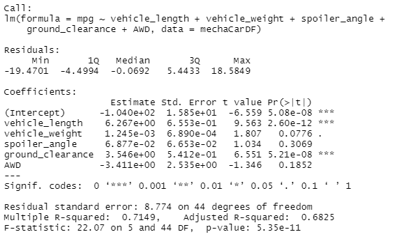
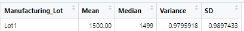
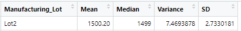
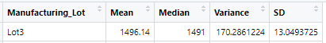
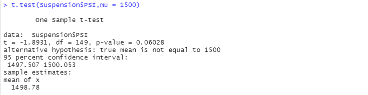
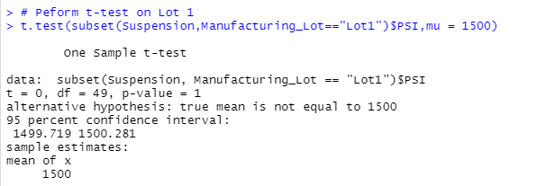
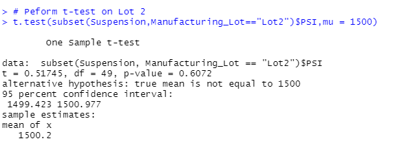
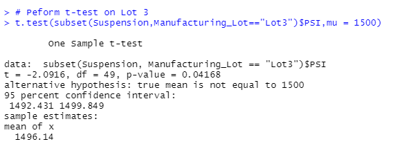

# MechaCar_Statistical_Analysis

## Linear Regression to Predict MPG

Using the following output, we can assess our linear model:

1. Which variables/coefficients provided a non-random amount of variance to the mpg values in the dataset?

Vehicle Length (p-value: 2.60e-12) and Ground Clearance (p-value: 5.21e-08) provide non-random amounts of variance to the mpg values due to their p-values being below 0.05. This means they are statistically significant to the mpg measure on these vehicles.

2. Is the slope of the linear model considered to be zero? Why or why not?

The slope of this linear model is not zero. This is evidenced by the fact that our p-value (5.25e-11) is MUCH smaller than our assumed significance level of 0.05%.

3. Does this linear model predict mpg of MechaCar prototypes effectively? Why or why not?

Yes, this model is effective at predicting mpg in the prototypes. The R-squared value is 71.5% which indicates that roughly 71.5% of the variability of mpg is explained by using this linear model. In addition, the p-value is 5.35e-11 which is much smaller than our assumed significance level of 0.05%.

## Summary Statistics on Suspension Coils

The design specifications for the MechaCar suspension coils dictate that the variance of the suspension coils must not exceed 100 pounds per square inch. Does the current manufacturing data meet this design specification for all manufacturing lots in total and each lot individually? Why or why not?

When evaluating all lots collectively, the data indicates MechaCar is indeed with in specification since the overall variance is 62.3:

However, when each lot is evaluated individually it is discovered Lot1 and Lot2 are within specifications, but Lot3 is grossly out of specification:

Lot 1

Lot 2

Lot 3

## T-Tests on Suspension Coils

To dive deeper into the suspension coils PSI and their representation of the population, t-tests are performed.

Our Null Hypothesis: There is NO statistical difference between suspension coil data mean and the population mean.

Our Alternate Hypothesis: There IS a statistical difference between suspension coil data mean and the population mean.

The above image shows the PSI summary test results for all lots. The p-value is 0.06 which is not within the 0.05 threshold to determine a significant statistical difference from the population. Therefore, this will fail to reject the null hypothesis.

PSI for Lot 1:

PSI for Lot 2:

PSI for Lot 3:

The above image is the PSI summary for Lot 3. This is where the null hypothesis is challenged. The p-value for Lot 3 is 0.04 and within the 0.05 threshold for a significant statistical difference from the population. Therefore, this will reject the null hypothesis for Lot 3 and the Alternate Hypothesis is accepted.

## Study Design: MechaCar vs. Competition

In your study design, think critically about what metrics would be of interest to a consumer: for a few examples, cost, city or highway fuel efficiency, horse power, maintenance cost, or safety rating.

To compare how MechaCar performs against the competition, several areas for metrics would be interesting to collect.

### Metrics: 

Fuel Efficiency, Maintenance Cost, Horse Power

### Null Hypothesis: 

MechaCar features are the same as other manufacturers' and do not impact purchasing decisions.

### Statistical Test & Why: 
Chi-Squared Test of independence which will determine if the categories of metrics are related to sales

### Data Needed: 
Sales data for the last five years, inclusive of vehicle features
